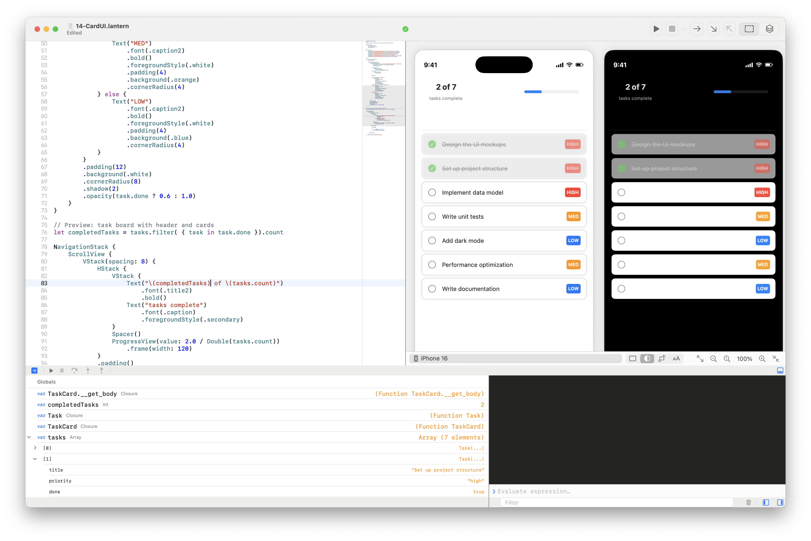
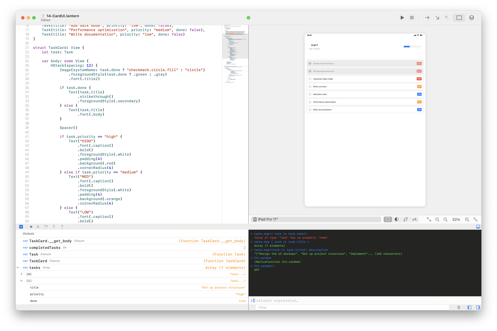

# Wick

An interactive development environment for the [Lantern](https://latenightsw.com) programming language. Wick combines a code editor, live preview, integrated debugger, and REPL console in a unified interface for macOS and iOS.

## Screenshots

### iPhone Preview with Variable Inspector



### iPad Preview with REPL Console



## Features

- **Code Editor** -- Syntax-highlighted editing with line numbers and breakpoint gutters
- **Live Preview** -- Renders SwiftUI-like output in real-time across iPhone and iPad form factors
- **Integrated Debugger** -- Set breakpoints, step over/into/out, navigate call stacks
- **Variable Inspector** -- Browse locals, captures, and globals with expandable tree view
- **REPL Console** -- Evaluate expressions interactively when paused or after execution completes
- **Execution Controls** -- Run, pause, stop, and step through code with toolbar buttons and keyboard shortcuts

## Requirements

- macOS 15+ or iOS 18+
- Swift 6.0
- Xcode 16+

## Dependencies

| Package | Description |
|---------|-------------|
| [LanternKit](../LanternKit) | Lantern language runtime, compiler, and debugger |
| [SplitView](../SplitView) | Custom split-view layout framework |

## Building

Wick is a Swift package with an executable target. Build and run using Xcode or the Swift command line:

```bash
swift build
```

Or open the package in Xcode and run the `Wick` scheme.

## Examples

Wick ships with 16 example programs in the `Examples/` directory that demonstrate Lantern's SwiftUI-like capabilities:

| # | Example | Topics |
|---|---------|--------|
| 01 | HelloWorld | Basic text display |
| 02 | TextStyles | Fonts and styling |
| 03 | Colors | Color usage |
| 04 | LayoutContainers | VStack, HStack, ZStack |
| 05 | ImagesAndLabels | Image and Label components |
| 06 | Modifiers | View modifiers |
| 07 | StateAndButtons | @State and Button actions |
| 08 | ProgressView | Progress indicators |
| 09 | NavigationStack | Navigation patterns |
| 10 | ListViews | List components |
| 11 | ComposedViews | Complex view composition |
| 12 | InteractiveForm | Form interactions |
| 13 | TransformsAndEffects | Visual transforms and effects |
| 14 | CardUI | Task board with cards, badges, and progress |

## Keyboard Shortcuts

| Shortcut | Action |
|----------|--------|
| Cmd+R | Run / Pause |
| Cmd+. | Stop |
| Cmd+Shift+O | Step Over |
| Cmd+Shift+I | Step Into |
| Cmd+Shift+U | Step Out |

## License

Copyright Late Night Software Ltd. All rights reserved.
